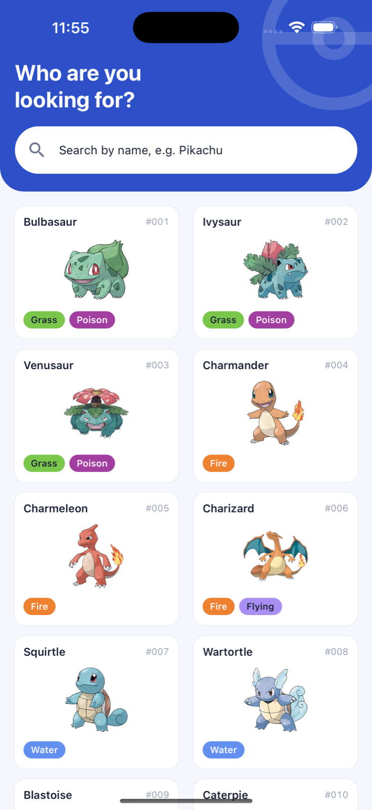
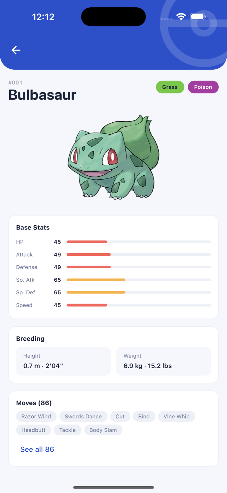

# Pokemon

A simple Pokémon mobile app built with **Expo** for the Senior Developer Assessment. Browse the Pokédex, search by name or number, filter by type, and open any Pokémon to see its stats, breeding info, and moves — all fetched live from [PokeAPI](https://pokeapi.co).

**Project type:** mobile app (Expo / React Native) — runs on iOS, Android, or the Expo Go client. No backend of its own, no authentication required.

## Screenshots

| List & search | Detail |
|:---:|:---:|
|  |  |

## Features

- **List screen** — 2-column card grid (artwork, name, Pokédex number, type chips) with infinite scroll and pull-to-refresh
- **Search & filter** — client-side search over the full Pokémon index by name (prefix matches rank first) or Pokédex number, plus a type filter that takes any combination of types and returns the Pokémon that have all of them. Search and filter compose: with both on, you get the name matches that are also in every selected type
- **Detail screen** — base stats with color-coded bars, height/weight in metric and imperial, and the full move list behind a "See all" toggle
- **Move details** — tap any move to see its type, damage class, power, accuracy, PP, and effect text
- **Offline persistence** — the Pokédex list, name index and type data are persisted to device storage, so the app opens populated on the next launch and stays browsable offline
- **Dark mode** — follows the system appearance; all colors resolve through semantic tokens, so both schemes share one component tree
- **Artwork fallbacks** — forms without official artwork (mega/gmax variants) fall back to their default sprite, then to a pokéball placeholder
- **Loading, error, and empty states** on every screen — skeleton cards that match the real card geometry, friendly error messages with a working **Try again**, and a "no results" state that names what was searched or filtered for
- **Navigation** — file-based stack navigation with Expo Router (list → detail → move → back)

## Tech stack

| Requirement | How it's used |
|---|---|
| Expo (SDK 57) | App platform + Expo Router for navigation |
| TypeScript | Strict mode throughout |
| React Native Paper | Searchbar, buttons, activity indicators, the filter bottom sheet, MD3 theme |
| NativeWind (v4) | All layout/spacing/typography styling via Tailwind classes |
| TanStack React Query | Server state: caching, infinite scroll pagination, prefetching, retries |
| AsyncStorage persister | Persists the small, bounded queries across launches for offline use |
| expo-image | Cached, fading artwork images |

## Getting started

Prerequisites: **Node.js 20+** and npm. For a simulator you'll need Xcode (iOS) or Android Studio (Android); otherwise install the **Expo Go** app on your phone.

```bash
npm install
npx expo start
```

Then:

- press **i** to open the iOS simulator, **a** for the Android emulator, or
- scan the QR code with **Expo Go** on a physical device (phone and computer must share a network).

### Verify it works

1. The list screen shows "Who are you looking for?" with a grid of Pokémon cards. Type chips appear on every card a moment after the grid does, as the type index loads.
2. Scroll to the bottom — the next page loads automatically.
3. Type `pika` in the search bar — Pikachu and friends appear; tap a card. Typing a number like `25` finds Pokémon by Pokédex id.
4. Tap the slider icon in the search bar and pick **Grass**, then **Poison** — the grid narrows to Pokémon that have both. Tap a chip under the search bar to remove that type.
5. The detail screen shows stats, breeding info, and moves; tap a move to see its power, accuracy, PP, and effect. The back arrow returns each time.
6. Switch the device to dark mode — every screen follows the system appearance.
7. Airplane mode, then relaunch: the list, search and type filter all still work from the persisted cache. Detail screens are cached in memory for the session only, so after a relaunch they show the error state with a working **Try again**.

## Tests

```bash
npm test               # 144 tests + coverage report (Jest + React Testing Library)
npm run test:watch     # watch mode, without coverage, for iterating
npx tsc --noEmit       # type check
npm run lint           # ESLint
```

### Coverage

| Statements | Branches | Functions | Lines |
|---|---|---|---|
| 100% | 100% | 100% | 100% |

Measured across every file in `src/` (`collectCoverageFrom` in `package.json`), not only the files the tests happen to import. `coverageThreshold` enforces 100% on all four metrics, so `npm test` fails if a single statement, branch or function goes uncovered. No `istanbul ignore` comments are used anywhere — every branch is reached by a real test.

### No mocking of application code

**No module under `src/` is ever mocked.** The screen tests boot the real Expo Router stack over the real route files with `renderRouter('src/app')` — the same `_layout.tsx`, providers, QueryClient, hooks, PokeAPI client and components that run on a device. The only seam is the network: `src/test/fakePokeApi.ts` installs a fake PokeAPI on `globalThis.fetch` that serves a 31-entry dex, and can be steered into going offline, failing a single type, or 404ing a resource.

Three native capabilities have no JavaScript implementation under Jest and are substituted at the platform boundary, each documented where it happens: AsyncStorage (swapped for the library's official in-memory backend), device colour scheme, and the native splash screen. Nothing else is faked.

| Suite | What it covers |
|---|---|
| `app/listScreen` | Grid rendering, progressive type chips, pagination and its stopping condition, pull-to-refresh, search by name/number/substring, single and multi-type filtering, chip removal, search+filter composition, empty states, list and index failures with working retries |
| `app/detailScreen` | Navigation from a card, press-in prefetch, stats, metric/imperial units, type chips, the 8-move preview and See all toggle, move navigation, back, artwork fallback, error and 404 states |
| `app/moveScreen` | Name/type/damage class, power/accuracy/PP, em dashes for null fields, `$effect_chance` interpolation, non-English effect fallback, error and retry |
| `app/appShell` | Splash hand-off, the one-time cache migration and its already-run branch, dark mode end to end |
| `app/missingRouteParam` | Both detail screens mounted at a route with no `[name]` segment, exercising their missing-param guards |
| `app/splashFailure` | The app still boots when the native splash screen rejects |
| `api/pokeapi` | URL building and normalization, pagination, 404 vs. network errors, entries with unparseable resource URLs |
| `api/pokeapi` (type index) | Slot ordering, one failing type skipped, *every* type failing rejects, progressive batch results, `__proto__`-named entries |
| `api/queryClient` | Legacy cache purge, unrelated keys preserved, persistence defaults |
| `hooks/usePokemonByTypes` | Empty selection, single roster order, multi-type intersection, disjoint types, partial failure, refetch |
| `hooks/usePokemonSearch` | Prefix-before-substring ranking, substring matching, id search ordering, `#` prefix and leading zeros |
| `components/*` | Card states and callbacks, artwork fallback chain, stat bars, error state, pokéball geometry, splash timing and theming |
| `theme/typeColors`, `utils/format` | Type colors, unknown-type fallback, text contrast, stat buckets; heights, weights, ids, name casing, sprite URLs, effect text |

## Project structure

```
src/
  app/                 # Expo Router screens
    _layout.tsx        #   Providers (persisted React Query, Paper) + stack
    index.tsx          #   List screen (search, filter, grid, pagination)
    pokemon/[name].tsx #   Detail screen (stats, breeding, moves)
    move/[name].tsx    #   Move detail screen (power, accuracy, PP, effect)
  api/
    pokeapi.ts         #   Typed PokeAPI client + the type-index build
    queryClient.ts     #   The QueryClient, AsyncStorage persister and cache migration
    queryKeys.ts       #   Every query key + the persistence allowlist
    types.ts           #   Minimal response shapes, limited to fields used
  hooks/               # React Query hooks (list, detail, move, search, types, type index)
  components/          # PokemonCard, TypeChip, TypeFilterSheet, StatBar, Artwork, skeletons, error state…
  theme/               # Design tokens: light/dark Paper themes + Pokémon type colors
  utils/               # Pure formatting helpers (unit-tested)
  test/                # Test harness: the fake PokeAPI, app renderer, appearance control
```

## Architecture notes

- **Server state over app state.** All remote data lives in React Query's cache; the only local state is UI state (search text, "show all moves"). Redux/Zustand would add indirection without benefit at this scope.
- **One type index instead of a detail per card.** The list endpoint doesn't include types, and fetching a ~200 KB Pokémon detail per card made deep scrolling crawl. Instead the 18 type endpoints are read once into a `name → types` map that every card reads from — 18 requests for the whole Pokédex rather than one per card. The map is built in batches so chips fill in progressively, and it reuses the same cache entries the type filter fetches, so a type is only ever downloaded once.
- **Offline-friendly by construction.** The persisted cache is an allowlist (`src/api/queryKeys.ts`): the list, name index, per-type rosters and type index — all small, bounded `{ id, name }`-shaped data — are written to AsyncStorage per query with a 24h max age. Pokémon and move details are deliberately left in memory only; they are large and unbounded, and persisting them filled up Android's storage. Failed background refetches keep showing cached data.
- **Detail prefetch on press-in.** Tapping a card starts its detail request before the navigation animation begins, so the detail screen usually renders straight from cache without reintroducing the per-card fetch.
- **Search is client-side.** PokeAPI only supports exact-name lookup, so the full index (~1300 entries, a few KB) is fetched once per session and filtered locally — by name, or by Pokédex number when the query is numeric.
- **Degrade, don't block.** The type index is secondary data, so a failure never takes over the screen: cards render without chips and pull-to-refresh rebuilds the index, retrying only the types that actually failed. A run where every type fails rejects rather than resolving empty, so a bad first launch can't persist "no Pokémon has any type" for 24 hours.
- **Design tokens in one place.** The palette lives as CSS variables (`src/global.css`) that flip with the system color scheme, mirrored by light/dark Paper MD3 themes (`src/theme/paperTheme.ts`) — dark mode required no per-component styling. Pokémon type colors include a luminance check so light chips (Electric, Ice…) get dark text in both schemes.
