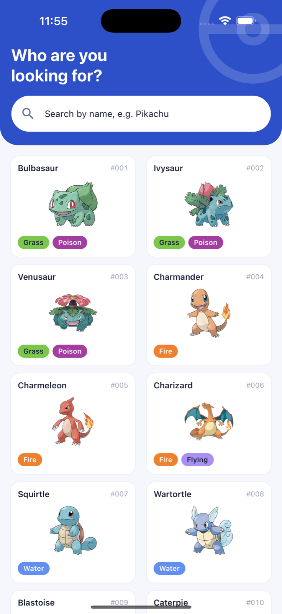
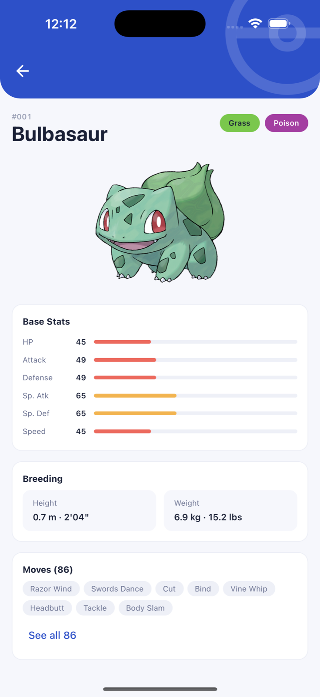

# Pokemon

A Pokémon mobile app built with **Expo** for the Senior Developer Assessment. Browse the Pokédex, search by name or number, filter by type, and open any Pokémon for its stats, breeding info and moves, all live from [PokeAPI](https://pokeapi.co).

**Project type:** mobile app (Expo / React Native), runs on iOS, Android or Expo Go. No backend, no authentication.

## Screenshots

|                                                List & search                                                |                                                         Detail                                                          |
| :---------------------------------------------------------------------------------------------------------: | :---------------------------------------------------------------------------------------------------------------------: |
|  |  |

## Features

- **List**: 2-column grid (artwork, name, Pokédex number, type chips) with infinite scroll and pull-to-refresh
- **Search & filter**: client-side search by name (prefixes rank first) or Pokédex number, plus a type filter taking any combination and returning the Pokémon that have all of them. The two compose.
- **Detail**: colour-coded base stats, height and weight in metric and imperial, full move list behind a "See all" toggle
- **Move details**: type, damage class, power, accuracy, PP and effect text
- **Offline**: list, name index and type data persist to device storage, so the app opens populated and stays browsable
- **Dark mode**: follows system appearance through semantic tokens; one component tree serves both schemes
- **Artwork fallbacks**: forms without official art (mega/gmax) fall back to their sprite, then to a drawn pokéball
- **Loading, error and empty states** on every screen, each with a working **Try again**
- **Navigation**: file-based stack via Expo Router (list → detail → move)

## Tech stack

| Requirement            | How it's used                                                               |
| ---------------------- | --------------------------------------------------------------------------- |
| Expo (SDK 54)          | App platform + Expo Router for navigation                                   |
| TypeScript             | Strict mode throughout                                                      |
| React Native Paper     | Searchbar, buttons, activity indicators, the filter bottom sheet, MD3 theme |
| NativeWind (v4)        | All layout/spacing/typography styling via Tailwind classes                  |
| TanStack React Query   | Server state: caching, infinite scroll pagination, prefetching, retries     |
| AsyncStorage persister | Persists the small, bounded queries across launches for offline use         |
| expo-image             | Cached, fading artwork images                                               |

## Getting started

Needs **Node.js 20+** and npm. For a simulator: Xcode (iOS) or Android Studio (Android). Otherwise install **Expo Go** on your phone.

```bash
npm install
npx expo start
```

Then press **i** for the iOS simulator, **a** for the Android emulator, or scan the QR code with Expo Go (phone and computer on the same network).

> Targets **SDK 54** deliberately. One Expo Go build runs one SDK, and the App Store hands older phones an older Expo Go: bumping the SDK makes the QR code unscannable on those devices.

### Verify it works

1. The list shows "Who are you looking for?" over a grid of cards; type chips fill in as the index loads.
2. Scroll to the bottom: the next page loads automatically.
3. Search `pika`, then `25`: matches by name and by Pokédex number.
4. Tap the slider icon, pick **Grass** then **Poison**: the grid narrows to Pokémon with both. Tap a chip to remove it.
5. Open a Pokémon, then one of its moves. The back arrow returns each time.
6. Switch the device to dark mode: every screen follows.
7. Airplane mode, then relaunch: list, search and filter still work from cache. Details are memory-only, so they show the error state with **Try again**.

## Tests

```bash
npm test               # 150 tests + coverage report (Jest + React Testing Library)
npm run test:watch     # watch mode, without coverage
npx tsc --noEmit       # type check
npm run lint           # ESLint
```

| Statements | Branches | Functions | Lines |
| ---------- | -------- | --------- | ----- |
| 100%       | 100%     | 100%      | 100%  |

Measured across every file in `src/`, not only the ones tests happen to import. `coverageThreshold` enforces 100% on all four metrics, and no `istanbul ignore` comments are used anywhere.

### No mocking of application code

**No module under `src/` is ever mocked.** Screen tests boot the real Expo Router stack over the real route files: the same layout, providers, QueryClient, hooks, PokeAPI client and components that run on a device. The only seam is the network: `src/test/fakePokeApi.ts` fakes `globalThis.fetch` with a 31-entry dex that can be steered offline, into a failing type, or into a 404.

Three native capabilities have no JavaScript implementation under Jest and are substituted at the platform boundary: AsyncStorage (the library's own in-memory backend), device colour scheme, and the native splash screen. Nothing else is faked.

## Architecture

```
src/
  app/                 # Expo Router screens: routes are files
    _layout.tsx        #   Providers (persisted React Query, Paper) + stack + splash + cache migration
    index.tsx          #   List screen (search, filter, grid, pagination)
    pokemon/[name].tsx #   Detail screen (stats, breeding, moves)
    move/[name].tsx    #   Move detail screen (power, accuracy, PP, effect)
  api/
    pokeapi.ts         #   Typed PokeAPI client + the type-index build (single fetch choke point)
    queryClient.ts     #   The QueryClient, AsyncStorage persister and cache migration
    queryKeys.ts       #   Every query key + the persistence allowlist
    types.ts           #   Minimal response shapes, limited to fields used
  constants/
    api.ts             #   Origins, page size, request timeout, fetch concurrency, search cap
    cache.ts           #   Stale times, retry count, max age, storage keys
    ui.ts              #   Skeleton count, list windowing, screen padding, preview limits
  hooks/               # React Query hooks (list, detail, move, search, types, type index)
                       # + usePokedexBrowser, which composes them into one list state
  components/          # PokemonGrid, SearchHeader, PokemonCard, TypeChip, TypeFilterSheet,
                       # StatBar, Artwork, skeletons, empty & error states…
  theme/               # Design tokens: light/dark Paper themes + Pokémon type colors
  utils/               # Pure formatting helpers (unit-tested)
  test/                # Test harness: the fake PokeAPI, app renderer, appearance & press helpers
```

### Architecture notes

- **Server state over app state.** Remote data lives in React Query's cache; only UI state is local. Redux/Zustand would add indirection without benefit at this scope.
- **Screens compose, hooks decide.** Four queries back the list, and which is authoritative depends on whether search, filter, both or neither is active. That resolution lives in `usePokedexBrowser`, so `index.tsx` stays a composition of components.
- **Constants are shared, not hoarded.** `src/constants/` holds what more than one module reads or what encodes a tunable policy. Numbers only one component can change (splash timings, pulse duration, a pokéball's ring ratio) stay beside it.
- **One type index, not a detail per card.** The list endpoint omits types, and fetching a ~200 KB detail per card made deep scrolling crawl. The 18 type endpoints are read once into a `name → types` map instead: 18 requests for the whole Pokédex, built in batches so chips fill in progressively, sharing cache entries with the type filter.
- **Offline by construction.** Persistence is an allowlist (`queryKeys.ts`): only small, bounded `{ id, name }` data, per query, 24h max age. Details stay in memory: large, unbounded, and persisting them filled Android's storage.
- **Prefetch on press-in.** Tapping a card starts its detail request before the navigation animation begins, so the detail screen usually renders straight from cache.
- **Search is client-side.** PokeAPI has no substring search, so the ~1300-entry index is fetched once per session and filtered locally, by name or by Pokédex number.
- **Degrade, don't block.** A failed type index never takes over the screen: cards render without chips, and refresh retries only the types that failed. A run where _every_ type fails rejects rather than resolving empty, so "no Pokémon has any type" can't be cached for 24 hours.
- **Design tokens in one place.** CSS variables (`src/global.css`) flip with the colour scheme, mirrored by light/dark Paper MD3 themes, so dark mode needed no per-component styling. Type colours include a luminance check so light chips (Electric, Ice…) get dark text.

## Performance

- **Virtualized list.** A `FlatList`, not `ScrollView.map()`: only the visible window mounts, so memory stays flat however deep you scroll. Tuned for the 2-column grid: `initialNumToRender={8}`, `maxToRenderPerBatch={8}`, `windowSize={7}`, `onEndReachedThreshold={0.4}`.
- **No N+1.** Card types come from the one shared type index (18 requests), not a detail fetch per card: the biggest performance decision in the app.
- **Prefetch on press-in.** Buys ~100-300 ms before the navigation animation ends, usually avoiding a spinner entirely.
- **Cheap re-renders.** `PokemonCard` is `React.memo` and purely presentational, so fast scrolling re-runs no data logic. The type-filter intersection uses a module-scope `combine`, letting React Query structurally share the result array across renders.
- **Progressive loading.** The type index publishes each batch of six as it lands, and skeleton cards match the real card geometry, so nothing shifts when data arrives.
- **Cached images.** `expo-image` handles on-disk caching and a 200 ms fade-in; the fallback chain (official art → sprite → drawn pokéball) means a 404 on a mega form never leaves a broken image or a retry storm.
- **React Compiler on** via `experiments.reactCompiler` in `app.json`, so components are auto-memoized at build time.
